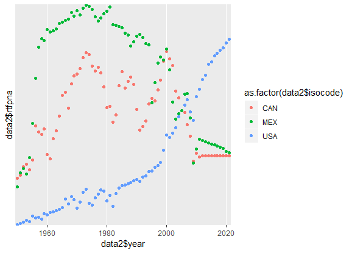

```{r setup, include=FALSE}
knitr::opts_chunk$set(echo = TRUE)

#####CODE WITH DATA MANIPULATION#####
rm(list = ls()) 

library(forecast)
library(ggplot2)

data= read.csv('TFP.csv')
t=c('isocode', 'year','rtfpna')
isocode = matrix(rep('USA'),10,1)
year = matrix(2012:2021, 10,1)
rtfpna = matrix(rep(0,10),10,1)
temp = as.matrix(cbind(isocode,year,rtfpna))
colnames(temp) = t


dataUSA =  data[1:62,1:3]
dataCAN = data[63:124,1:3]
dataMEX = data[125:186,1:3]

isocode = matrix(rep('USA'),10,1)
e=as.data.frame(forecast(dataUSA$rtfpna, h=10))[1]
e=cbind(isocode,year,e)
colnames(e) = t
dataUSA2 = rbind(as.matrix(dataUSA),as.matrix(e))

isocode = matrix(rep('CAN'),10,1)
c=as.data.frame(forecast(dataCAN$rtfpna, h=10))[1]
c=cbind(isocode,year,c)
colnames(c) = t
dataCAN2 = rbind(as.matrix(dataCAN),as.matrix(c))


isocode = matrix(rep('MEX'),10,1)
m=as.data.frame(forecast(dataMEX$rtfpna, h=10))[1]
m=cbind(isocode,year,m)
colnames(m) = t
dataMEX2 = rbind(as.matrix(dataMEX),as.matrix(m))

data2=as.data.frame(rbind(dataUSA2,dataCAN2,dataMEX2))###problemaAqui
rownames(data2) <- NULL
rownames(data2$isocode) <- NULL
rownames(data2$year) <- NULL
rownames(data2$rtfpna) <- NULL
colnames(data2) <- t


p <- ggplot(data2, aes(x = data2$year, y = data2$rtfpna , color = as.factor(data2$isocode)) ) +
  geom_point() +
  scale_y_discrete(breaks = c(0.6,0.8,1.0,1.2,1.4)) +
  scale_x_discrete (breaks =c(1940,1960,1980,2000,2020))


```

## Data manipulation

All the data manipulation are avaliable and also can be explored/reproduced in the file forecasting.R

{ width=50% }

We can see in **Fig. 1** below the forecast of rtfpna for the countries presented (USA, MEX and CAN).

Based on **this** parameter of historical evolution, we can expect a great growth in the USA compared to CAN and MEX.

Although the historical average is a relatively reliable parameter, a model based purely on that parameter is unable to predict behavior in adverse situations (such as the current scenario with the pandemic of COVID-19).

In this database, any variable derived from TFP (ctfl for example) could be used to explain a series of TFP. However, this is a tautological argument.

Similarly, any combination, linear or otherwise, of two or more parameters that are a good fit for the historic TFP is a good initial candidate for creating a slightly less rudimentary model.